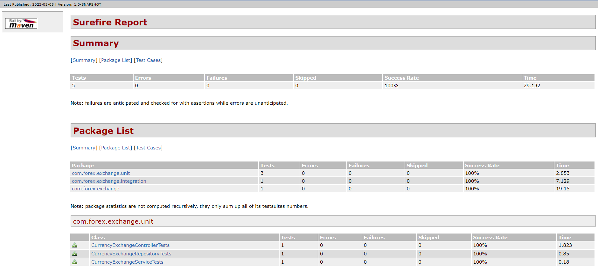

# Unit Test
To demonstrate unit testing on REST API service. 

### Unit test for API service built in Java

## Stack

| Category  | Value                       |
|-----------|-----------------------------|
| Language  | Java                        | 
| Build Tool | Maven                       |
| Test Tool | JUNIT5                      |  
| framework | Spring Boot                 |
| Report    | Maven Surefire Report Plugin | 


## API Service
* GET currency conversion for example USD => INR

## Objective

* To demonstrate unit testing practices on different layers
* Controller Layer
* Data layer
* Service Layer
* Integration Test to test all layers

## Approach

Brief description on the important packages.

### features
* WebMockMvc to test Controller layer logic in isolation.
* DataJpa to test Data layer that is Jpa Repository.
* Mockito to test service layer logic in isolation
* Rest Template to perform Integration test


spring profiles -
* default - application.yml


Run tests:
```$xslt
mvn clean test surefire-report:report
```

### Reports
Maven Surefire Report Plugin will generate report all the test run in the execution

Sample screenshot of report for the execution below:

